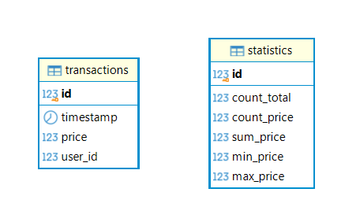
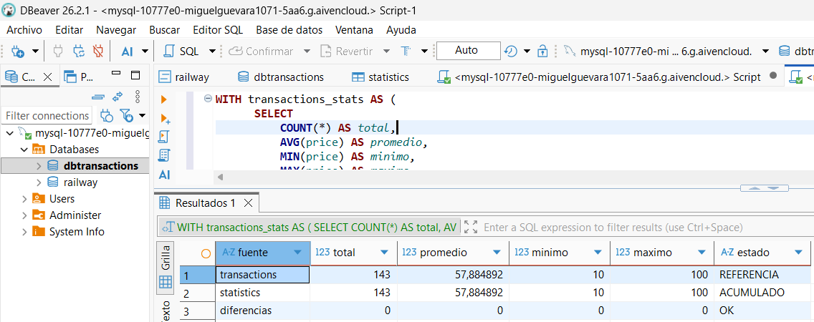
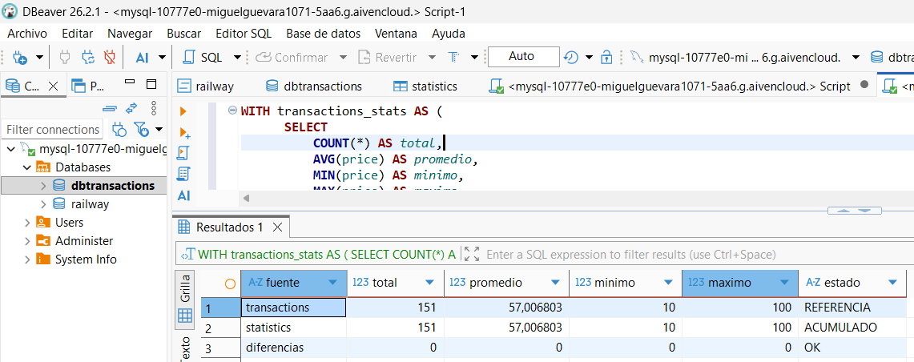
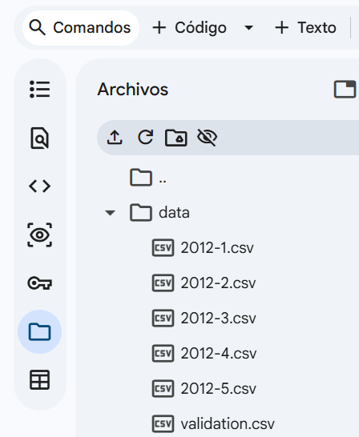
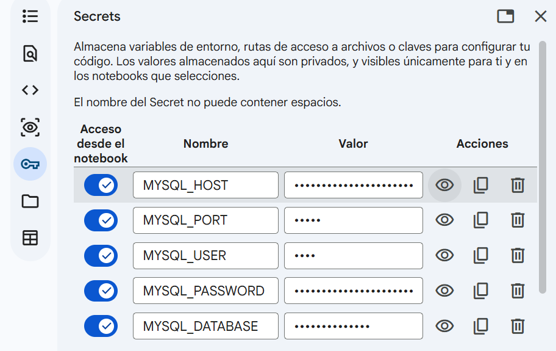

# Microbatch Data Pipeline

Este repo es mi solución a una prueba de ingeniería de datos. La idea era armar un pipeline que cargue archivos CSV por partes (micro-batches), los guarde en una base de datos y lleve estadísticas en vivo sin consultar toda la tabla a cada rato.

Lo trabajé en Google Colab (`Prueba_ingenieria_datos.ipynb`), ahí está todo explicado paso a paso.

## Contenido

- `Prueba_ingenieria_datos.ipynb`: pipeline completo.
- `data/`: viene vacía en GitHub, ahí van los CSV antes de correr.
- `requirements.txt`: solo para uso local (en Colab no se necesita).

## Datos

El notebook espera estos archivos dentro de `data/`:

```
data/
  2012-1.csv
  2012-2.csv
  2012-3.csv
  2012-4.csv
  2012-5.csv
  validation.csv
```

Todos tienen `timestamp, price, user_id`. Se procesan los 5 del 2012 en orden y `validation.csv` se deja para el final. No subí los CSV para mantener el repo liviano y tambien por seguridad nunca se suben datos.

## Base de datos

Usé MySQL desplegado en la nube con Railway en su plan gratuito, así probaba contra una base real y no solo en local.

Tablas:

- `transactions`: guarda lo que viene en los CSV tal cual.
- `statistics`: una sola fila (id = 1) con `count_total, count_price, sum_price, min_price, max_price`. El promedio es `sum / count`.



## Decisiones principales

- **Fecha como `DATE`:** los CSV vienen sin hora, tipo `1/10/2012`. O sea, origen sin hora, por eso DATE y no DATETIME.
- **Nulos como `NULL`:** hay 4 precios vacíos. No los borré ni los rellené porque no es un pipeline de limpieza. Manejo `count_total` aparte de `count_price`.
- **Estadísticas incrementales:** actualizo `statistics` con `UPDATE ... LEAST / GREATEST`, sin hacer `SELECT AVG` en cada carga. Solo al final hago consultas directas para comprobar.
- **Un archivo a la vez en memoria**, en orden, y cada batch se confirma con una sola transacción.

## Resultados

- Tras 5 archivos: `Total 143 filas, promedio 57.884892, min 10, max 100`


> Nota: Sin diferencias.

- Tras `validation.csv`: `Total 151 filas, promedio 57.006803, min 10, max 100`


> Nota: Sin diferencias.

## Cómo correrlo en Colab (recomendado)

1. Abre el notebook en Colab. La primera celda ya instala lo necesario, no uses el `requirements.txt`.
2. Sube los 6 CSV a la carpeta `data/` (panel de archivos de Colab).



3. En Secrets de Colab guarda la conexión a MySQL con estos nombres:
`MYSQL_HOST, MYSQL_PORT, MYSQL_USER, MYSQL_PASSWORD, MYSQL_DATABASE`



4. Corre las celdas en orden. Para repetir desde cero, ejecuta primero `limpiar_tablas()` del anexo.

## Nota: uso en local (opcional)

Solo si lo quieres correr fuera de Colab:

1. `pip install -r requirements.txt`
2. Pon los CSV en `data/`.
3. Copia el ejemplo y complétalo: `cp .env.example .env` (el `.env` no se sube a GitHub). El notebook lo lee solo si no está en Colab.
